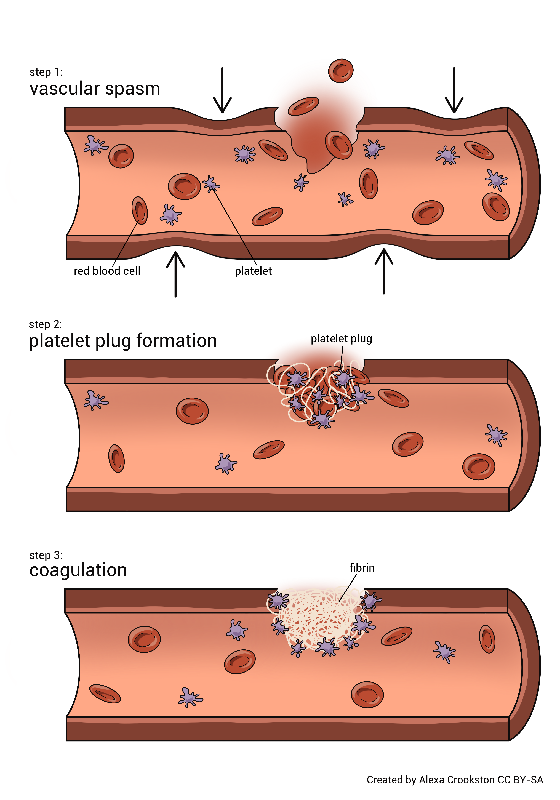
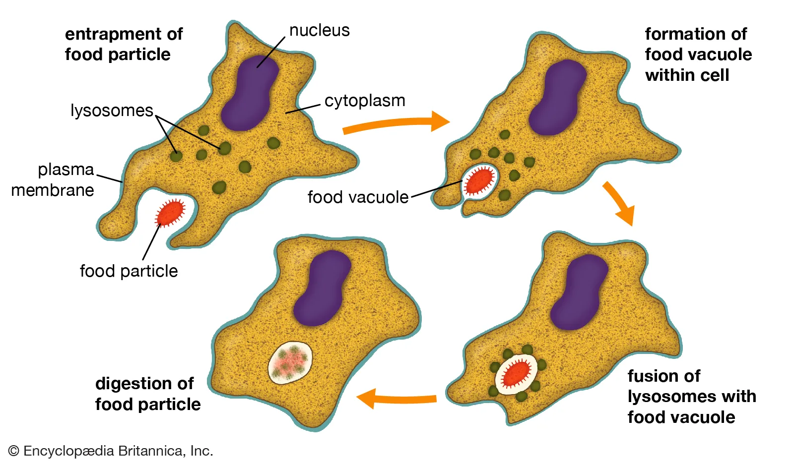
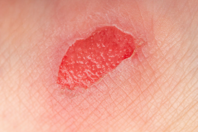
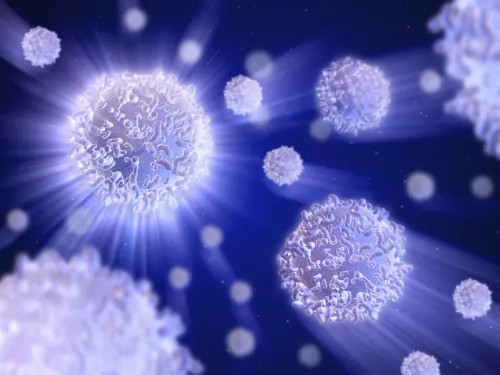

# Standard Operating Procedure (SOP)
## Process: How White Blood Cells Help the Body Heal a Wound

**Group Name:** Group 6  
**Course:** ____Technical Writing and Documentaion______________  
**Instructor:** ___Jibing Liang_______________  
**Date:** April 02,2026  

---

# Approval Table

| Name | Role | Signature | Date |
|------|------|-----------|------|
| Bikramjit Singh| Author |___ | April 2,2026 |
| Angadveer Singh | Reviewer |___ April 2,2026  |
| Harveer Singh| Editor |___ | April 2,2026 |
| Armaanjot SIngh | Presenter |___ | April 2,2026 |
| Instructor | Approver |___ |April 2,2026  |

---

# Revision Information

| Version | Date | Description | Author |
|--------|------|-------------|--------|
| 1.0 | April 2,2026 | Initial Draft | Group 6 |

---

# Purpose

The purpose of this Standard Operating Procedure (SOP) is to explain the step-by-step process of how white blood cells help the human body heal a wound. This document describes how the body stops bleeding, protects the wound from infection, repairs damaged skin, and completes the healing process naturally.

---

# Scope

This SOP applies to students studying the natural wound healing process in the human body. It explains the role of white blood cells and the stages involved when the skin is injured and begins recovery.

---

# Objectives

This SOP helps readers:

- understand what happens when the skin gets cut
- explain how white blood cells protect the body
- identify the stages of wound healing
- understand how new skin forms after injury
- describe how the wound closes completely

---

# Accountability Matrix

| Task | Responsible Member |
|------|-------------------|
| Research | Student Name |
| Documentation Writing | Student Name |
| Visual Collection | Student Name |
| Presentation Delivery | Student Name |

---

# Definitions

**Platelets** – Small blood components that help stop bleeding  

**White Blood Cells** – Cells that protect the body from infection  

**Scab** – Protective covering formed over a wound  

**Tissue Repair** – Process of rebuilding damaged skin  

---

# Procedure Steps

## Step 1: Bleeding Begins

When the skin gets cut, small blood vessels under the skin break and bleeding starts. This bleeding is the body's natural response to injury. Platelets quickly move to the injured area and gather together to form a blood clot. This clot works like a protective plug that stops bleeding and prevents germs from entering the body.

After some time, the clot becomes dry and forms a scab on the surface of the wound. The scab protects the wound while healing begins underneath.

### Image for Step 1
_Add your Step 1 image here_

**Figure 1:** Platelets forming a clot to stop bleeding after skin injury.

---

## Step 2: White Blood Cells Protect the Wound

After the bleeding stops, white blood cells travel to the injured area through the bloodstream. These cells act like the body's defense system and protect the wound from infection. They destroy bacteria and remove damaged tissue from the wound area.

Sometimes the skin around the wound becomes red or swollen. This is normal because white blood cells are actively working to protect the body and support healing.

### Image for Step 2
_Add your Step 2 image here_

**Figure 2:** White blood cells destroying bacteria at the wound site.

---

## Step 3: New Skin Begins to Form

After the wound is cleaned by white blood cells, the body begins repairing the damaged area. New skin cells start growing under the scab, and small blood vessels form around the wound. These blood vessels bring oxygen and nutrients that help the healing process continue faster.

As new tissue forms, the wound slowly becomes smaller and stronger each day.

### Image for Step 3
_Add your Step 3 image here_

**Figure 3:** Growth of new tissue and blood vessels during healing.

---

## Step 4: Wound Closes Completely

In the final stage, new skin continues growing until the wound is fully closed. The scab becomes dry and falls off naturally once healing is complete. Sometimes a small scar may remain depending on how deep the injury was.

This stage shows that the body has successfully repaired itself and the healing process is complete.

### Image for Step 4
_Add your Step 4 image here_

**Figure 4:** Final stage of wound healing after skin repair.

---

# Conclusion

Wound healing is a natural process that protects the body from infection and repairs damaged skin. White blood cells play an important role in cleaning the wound and supporting tissue repair. This process allows the body to recover safely and return to normal condition after injury.

---

